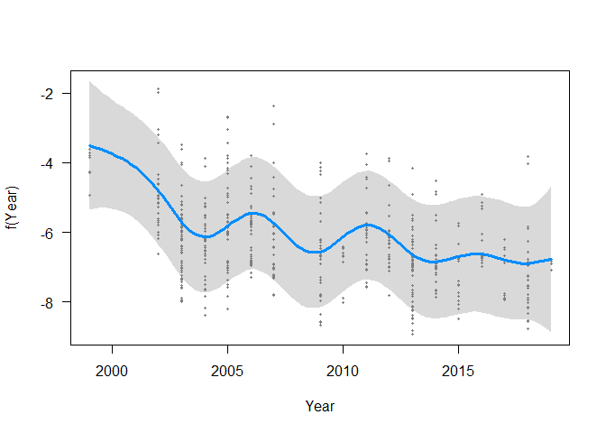
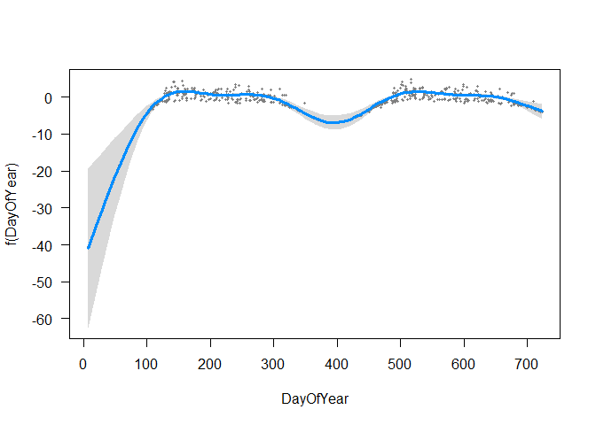
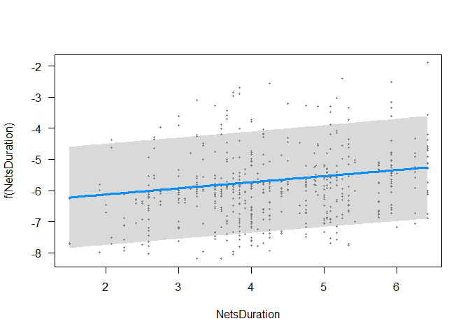
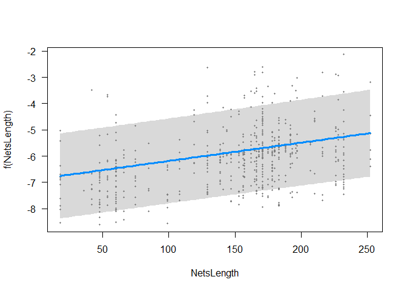

Using ringing data to inform a geolocator study: when and which birds to
equip?
================
true

# Introduction

Light-level geolocators are a well-established technology used to study
bird migration. They have become popular due to their relatively low
cost and light weight, making them the only tool available to study
migration patterns of smaller birds (Bridge et al.
[2011](#ref-Bridge2011)). For these reasons, geolocators have helped
advance our understanding of bird migration on a number of levels:
identifying migration routes and wintering locations (e.g. Salewski et
al. [2013](#ref-Salewski2013); Smith et al. [2014](#ref-Smith2014);
Liechti et al. [2015](#ref-Liechti2015); Kralj et al.
[2020](#ref-Kralj2020)), revealing migration strategies (e.g. Adamík et
al. [2016](#ref-Adamik2016); Briedis et al. [2019](#ref-Briedis2019);
Hahn et al. [2020](#ref-Hahn2020)) and migratory connectivity
(e.g. Finch et al. [2015](#ref-Finch2015); Procházka et al.
[2017](#ref-Prochazka2017); McKinnon and Love
[2018](#ref-McKinnon2018a)), among others. Geolocators bear strong
potential to uncover long-distance Afro-tropical migration patterns,
many of which remain still largely unknown (e.g. Benson
[1982](#ref-Benson1982); Bennun [2000](#ref-Bennun2000); Cox et al.
[2011](#ref-Cox2011); Bussière, Underhill, and Altwegg
[2015](#ref-Bussiere2015); Nwaogu and Cresswell [2016](#ref-Nwaogu2016);
Osinubi [2018](#ref-Osinubi2018)). As habitat destruction and climate
change accelerate and adversely affect migrant birds, it is becoming
urgent to better understand these patterns to effectively protect these
migratory bird populations (e.g. Simmons et al.
[2004](#ref-Simmons2004); Sekercioglu [2010](#ref-Sekercioglu2010);
Şekercioĝlu, Primack, and Wormworth [2012](#ref-Sekercioglu2012);
Vickery et al. [2014](#ref-Vickery2014)). Geolocators are instrumental
in helping us gain understanding of migration routes, timing, triggers
and variability, as well as identifying breeding, wintering and stopover
sites to protect. Thanks to their low price, geolocators are
particularly well-suited to projects with limited budgets. However,
geolocators are not without drawbacks. The tags must be retrieved to
recover data, harnesses can fail, bird survival might be impacted,
latitudinal precision can be relatively poor, and the data analysis can
be difficult and prone to errors. With the increasing number of studies
using geolocators, these challenges have been partially addressed.
Increased experience with this technology has helped improve survival
rates through minimum relative load and non-elastic harness technology
(e.g. Streby et al. [2015](#ref-Streby2015); Weiser et al.
[2015](#ref-Weiser2015); Brlík et al. [2020](#ref-Brlik2020)). Data
analysis has also become more accessible and accurate (e.g. Lisovski et
al. ([2012](#ref-Lisovski2012)); Lisovski et al.
([2020](#ref-Lisovski2020))) and common pitfalls in analysis have been
discussed (e.g. Fudickar, Wikelski, and Partecke
[2012](#ref-Fudickar2012); Lisovski et al. [2012](#ref-Lisovski2012),
[2018](#ref-Lisovski2018)). Finally, more recent geolocators also
measure temperature, air pressure and bird activity, providing further
precision in geolocation and additional research opportunities
(e.g. Meier et al. [2018](#ref-Meier2018); Liechti et al.
[2018](#ref-Liechti2018); Dhanjal-Adams et al.
[2018](#ref-Dhanjal-Adams2018); Sjöberg et al. [2018](#ref-Sjoberg2018);
Jiguet et al. [2019](#ref-Jiguet2019); Briedis et al.
[2020](#ref-Briedis2020)). Despite this progress, geolocator studies
still need to be carefully planned (in terms of field time, research
questions, sample size etc.) to improve the recapture rate of birds in
subsequent years. In this study, we present an example of one geolocator
study carried out on two Afro-tropical migrants in Kenya. This study
will demonstrate how pre-deployment analysis using an existing ringing
database can help optimize the deployment of geolocators. We focus on
two questions in particular: (1) how many birds can we expect to capture
during a full season for a given ringing schedule and (2) how can we
maximize bird recapture by equipping specific classes of birds
(e.g. sex, age) during specific periods of the year?

# Materials and methods

## Ringing site and database

The A Rocha Kenya Conservation Centre is located on the coast of Kenya
and in the middle of the Northern Zanzibar-Inhambane Coastal Forest
Mosaic ecoregion (322’36.3“S 3959’16.9”E). This region is recognized for
its high biodiversity value (Marris [2010](#ref-Marris2010)) yet faces
increasing habitat fragmentation due to the expansion of agriculture and
charcoal burning (Burgess and Clarke [2000](#ref-Burgess2000CoastalFO)).

The Conservation Centre is located on a residential coastal scrub/forest
that has benefited from limited habitat change over the last 50 years
(Alemayehu [2016](#ref-Alemayehu2016)), in the effort to preserve the
ecosystems for tourism purposes. Mist nets are placed in a nature trail
that runs through a small patch of forest managed by the Conservation
centre.

In this study, we use the ringing dataset from ringing sessions
conducted regularly from 2002 to present. Up to early 2019, the dataset
consists of 3372 entries of 2532 rings covering 96 species collected
during 317 sessions. The ringing effort presents some temporal
variability, as well as variability in the metadata recorded (see SM1).
In general, sessions start at sunrise (M=06:12 ; SD=00:14) and last
until bird activity slows down (session duration M=04:08 ; SD=01:01)
(see Figure 7 in SM1). On average, a total of 154.3424658 m
(SD=51.5159682 m) of nets were used. Descriptive notes on weather
conditions were also included, and later classified according to their
expected influence on the capture rate (none, little, large). We
manually checked extreme values in the dataset and removed those that
could not be verified.

In addition, we also present the ringing data of 2020, when the
geolocators were first deployed. We did not include this data in the
fitting of the models but rather used it for comparison and discussion
purposes.

In this case study, geolocators were placed on Red-capped Robin-chats
Cossypha natalensis (RCRC), a terrestrial thrush wintering in the area
from April to October, to uncover their summering site and migration
routes (Nussbaumer & Jackson, 2020). RCRC are known to hold territory on
their wintering sites and show site fidelity (C. Jackson, personal
communication), thus making them an ideal candidate for a geolocator
study.

## Capture model

An early question in the planning stage is how many geolocators to
deploy and therefore order. To answer this, it is important to
accurately estimate the number of individuals that can realistically be
captured per ringing season. Geolocators are configured to collect data
for a single year, and therefore cannot be kept for future studies.
Overestimating the individuals captured would thus result in wasting
devices, while underestimating would result in missed opportunities. The
estimation also directly influences the ringing effort planned
(i.e. number of sessions, duration of session, number of nets etc). To
address this question, we followed a three-step process described below.

In the first step, we modelled the number of RCRC captured per session
using a generalized additive model (GAM), assuming the number of
captures follows a Poisson distribution. The predictor variables tested
in the model are (1) year (2) day-of-year, (3) duration of the session,
(4) total length of nets, (5) starting time and (6) weather conditions.
To overcome the lack of sufficient data for the duration, start time and
length of nets, we used multiple imputation methods by chained equations
(Azur et al. [2011](#ref-Azur2011)) to generate 30 sets of data without
any missing values. For each of these sets, a GAM model was fitted.

In the second step, we addressed the problem that RCRC can only be
equipped once a year. A first approach tested was to model the count of
new birds (i.e., birds that have not yet been captured in the same year)
rather than the total number of birds. However, this count depends on
how many RCRC have already been equipped earlier in the year. Instead,
we preferred to model the probability that a bird captured was not
already captured in the same year. This probability is modelled with a
Generalized Linear Model (GLM) using a binomial family and a single
explanatory variable consisting of the total number of RCRC captured in
the year.

In the third step, we used the two models above to predict the number of
RCRC that can be captured over one year. This number is estimated from
the prediction of the models under various ringing scenarios. The
default scenario for our ringing season of 2020 is to ring every week
for 4 hours using 156m of nets. Using the first model and this
information, we can estimate the total number of RCRC that would be
captured in the season. Knowing how many birds have been captured, we
used the second model to predict how many unique RCRC can be equipped
along the year by multiplying the number of captures by the probability
of each individual being a new bird. Finally, assuming that the sessions
are independent conditional to the model, we estimate the total number
with a cumulative sum over the year.

This approach was performed under different scenarios where we modified
the number of ringing sessions, total length of nets, and duration of
ringing session. The default scenario includes 4 hr-ringing sessions
every 10 days with 156 m of nets. We tested the influence of increasing
the duration of the ringing sessions to 6 hrs and the length of nets to
225 m. In addition, we tested an optimized ringing schedule where more
ringing sessions are held during the peak passage. Finally, we also
compared the actual number of RCRC captured in 2020 with the prediction
of our model using the exact session durations and lengths of nets.

## Recapture model

Data collected by geolocators can only be retrieved if the equipped bird
is recaptured in the following years. Consequently, to optimize the
study it is essential to equip those birds that are most likely to be
recaptured. Here too, the ringing database can inform this decision, in
this case by providing the recapture rate of a bird as a function of the
date of equipping but also of the age and weight of the bird. Using this
information, the ringer can make an informed decision about whether or
not to equip a captured bird. This decision should also account for the
total number of geolocators available and the number of sessions left.

In this study we looked at two parameters: the time of year and the age
class (adult or juvenile). The recapture probability is estimated by
modelling the binomial response of whether a captured bird will be
recaptured in the following years: we consider that an individual is
recaptured if the bird has been recaptured at least once in any of the
following years, and this is independent from whether it was already
captured in the past. We modelled the count of adults and juveniles per
session separately to reveal the influence of age on recapture rates.
The weight of the bird was left out of the model as it showed little to
no effect on the recapture rate (see Figure 10 in SM3). Additionally, we
also compare the recapture rate for RCRC captured for the first time and
those which have already been equipped.

All computation was performed on R (R Core Team [2013](#ref-team2013r)),
using the MCGV package (Wood [2017](#ref-wood2017generalized)) for GAM,
and the Mice Package (Buuren and Groothuis-Oudshoorn
[2011](#ref-Buuren2011)) for the imputation.

# Results

## Capture model

A GAM model was fitted to the data to model the number of RCRC captured
for each session. After testing several parametrizations of the model
(see SM2), we retained the capture model that included a smooth function
of day-of year, year and total length of a linear function of the
duration of the session. The fitted model for the default case (156 m of
nets and session duration of 4 hrs) together with the raw counts data is
illustrated in Figure 1. The model fits a typical migrant phenology
curve, with a steep increase in the numbers in May, peaking in early
June with almost three RCRC per session. The second peak of returning
birds in mid-September is much smaller with only 1.5 birds/session on
average. The counts of 2020 show an early arrival of birds (peak in
second half of May), but overall, within the range of a typical year.

We modelled the probability of recapture within a year to extract the
number of unique birds captured during a single year (Figure 2). As the
cumulative number of RCRC captured increases, so does the recapture rate
and consequently, the probability of being a new bird decreases from
around 100% for the first bird to 60-70% after 40 RCRCs have been
captured in the year. Note that this approach can only reliably estimate
the probability up to a maximum of around 40 RCRCs captured in a year.

![The probability of capturing a new bird (i.e., a bird not yet captured
in the current year) as a function of the number of RCRC capture
increases. The colour and size of the points indicate the number of
occurrences in the dataset that the nth bird caught in a year had
already been caught during the year (bottom, old bird, 0%) or the first
time it was caught this year (top, new bird, 100%). The line shows the
fitted model of the probability that a bird is a new bird as a function
of its rank of
capture.](manuscript_files/figure-gfm/prob-new-bird-1.png)

![Model predictions of the total unique RCRC caught along a year
following different scenarios. The default scenario consists of 4hr
ringing sessions using 156m of nets every 10 days. ‘6h’ and ‘225m’ are
modifications of the default scenario, and ‘optimized’ increases the
number of sessions (to every week) during the peak passage (mid-May –
July) and decreases them (to every 2 weeks) during the rest of the year.
Finally, using the exact date, duration, and net length used in 2020,
the model prediction ‘2020 model’ can be compared to the actual data
(‘2020 data’).](manuscript_files/figure-gfm/total-rcrc-captured-1.png)

Five different scenarios of ringing were modelled to estimate the total
number of unique RCRC captured along the year in Figure 3. Compared with
the total number of birds caught at the end of year with the default
scenario (16), increasing the duration of ringing sessions by two hours
(‘6hr’) or adding 44m of additional nets (‘200m’) results in only three
more birds caught (19). However, the optimized scenario yields many more
birds, with a total of 22 birds captured in fewer number of sessions (31
instead of 37).

In 2020, 27 ringing sessions were held with 156 m of mist nets, with an
average duration of 3:45 (SD: 0:59). As of the 1st of November, a total
of 29 RCRC were capture from 23 unique individuals. For the exact same
information, the model predicted an expected total of 23 RCRC from 20
individuals.

## Recapture model

Over the 161 unique RCRC individuals captured in the dataset, 67 (42%)
were recaptured at least once (including recapture the same year). When
considering the 301 capture events (including same individuals), the
general recapture rate increases to 47%. However, looking at captures
with recapture in any subsequent year, the recapture rate is 30%. In the
rest of the study, we employ the latter definition of recapture rate to
eliminate intra-season recaptures and consider only recaptures in
subsequent years, when geolocators can be retrieved.

In general, adults show a slightly higher recapture rate (34%) than
juveniles (27%). When modelled over the day of year (Figure 4a), the
recapture rate in subsequent years shows that birds equipped later in
the year are twice as likely to be recaptured, with a recapture rate
increasing from 25% to almost 50%. Separating adults from juveniles
allows us to identify further trends. The increase in juveniles’
recapture rate is not significant. By contrast, adults show a clear
increase from May to August, before stabilising from September to
October. Modelling the number of captures of adults and juveniles
(Figure 4b), we observe an earlier arrival of juveniles (late May vs
early June for adults) and earlier departure in August, while adults
show a second peak early October.

Finally, a RCRC which has already been captured in the past has a higher
recapture rate (36%) compared to a bird without a ring (24).

# Discussion

In this paper, we provide an example of how a ringing dataset can inform
the design and planning of a geolocator study.

## How many captures?

The method outlined above allows us to estimate the total number of
individual birds that can be captured and equipped with geolocators
during a single season while accounting for the ringing schedule (number
of sessions along the year, length of nets, and session duration).

In addition, the capture model provides practical information for
planning ringing sessions with the goal of maximizing the number of RCRC
captured. Increasing the duration of ringing sessions from four to six
hours and increasing the length of nets only slightly improves the total
number of RCRC captured. This is explained by the fact that RCRC are
mostly active in the early hours of the day, and that additional nets
are placed in successively sub-optimal habitats. By contrast, increasing
the number of sessions as well as selecting the right time of year
significantly increases the number of captures. This model allows us to
identify an optimal ringing schedule, with the highest number of RCRC
captured (22 vs 16) for the fewest ringing sessions (31 vs 37) (Figure
3).

In 2020, the initial plan was to ring at minimum every two weeks, and
every week during peak passage (from May to early June and from late
August to October). Following an earlier and simpler capture model (not
accounting for annual trends or recapture rates), we expected to capture
a total of 30 individuals. Because of uncertainties surrounding the
first deployment year, we conservatively requested 15 geolocators. This
was meant to allow for flexibility in learning how to equip, and how to
select which birds to equip and when throughout the year.

## How to improve recapture rates?

For the geolocator study to be successful, not only do we need to
maximize the number of birds equipped (with minimal ringing effort), but
also optimize their recapture (i.e. number of geolocators retrieved). We
analysed the recapture data for two parameters: age class, and capture
date in the year.

Equipping individuals which have already been captured before has the
largest influence on recapture, improving the probability of recapture
by 1.5 times (36% vs 24%). Moreover, equipping adults provides better
probability of recapture than juvenile (34% vs 27%). This is especially
true for adults captured later in the year, which suggest that these
adults are holding territories on site and thus coming back every year.

This information was included in our deployment by equipping all adults,
especially if they had already been captured. While waiting for
July/August seemed preferable to increase the recapture rate, the number
of birds captured decreases strongly in this period. In addition, to
learn more about the age difference patterns observed in the ringing
data and to test the hypothesis of variable departure/arrival dates
based on age, we decided to equip both juveniles and adults. In
practice, we limited ourselves to the deployment of 6 RCRC up to
mid-June (out of the 15 available), when juveniles were more common
(74%), in order to have enough geolocators in July and August, when we
were able to equip more adults (53%). Model validation, limitation and
extension

We can loosely validate the capture model results with the actual data
collected in 2020, though caution is needed as this represents only a
single year. The number of RCRC captured in 2020 is comparable to the
model estimate, albeit slightly higher. The arrival date proved to be
earlier than the average and the numbers appeared to be higher than
average at the beginning of the season. This could be due to a
particularly good breeding season (many juveniles caught during this
period) and/or affected by the playback used near the nets (not done in
previous years).  
The approach followed in this paper contains some limitations. Firstly,
we considered a recapture as when a bird was captured again in any
subsequent year of the initial capture. However, for a geolocator study,
the recapture needs to happen within the duration of the study. The
recapture rate of the full dataset (30%) reduces to 19% when considering
only recaptures happening exactly the following year, 26% for the
following 2 years, and 28% for the following 3 years. This suggests that
we should keep ringing for at least 2 seasons after captures to benefit
from a maximum of geolocator data. Secondly, by using recapture data
from the ringing database as a proxy for recaptures involving
geolocators, we ignore the effect of geolocators on survival rate (or
site fidelity). There have been instances where geolocators have had an
impact on survival, thus leading to lower recapture rates than for rings
(unknown effect of ring).

One last question remained to be answered to finalise the geolocator
study, and that was when nets should be put up in the following year to
attempt to recapture birds. To answer that question, we simply verified
that the probability of capturing a recapture (i.e. a bird captured
before) or a new bird is the same throughout the year. We verified that
this is the case in Figure 9 in SM3, thus suggesting that one simply
needs to follow the result of how to maximize captures to also maximize
recaptures.

Although the model and results of this study are tailored for the
specific case of RCRC on coastal Kenya, the application of this
methodology can be extended to other situations where ringing data are
available for a study site. In general, our methodology is only
applicable for cases where the deployment of geolocators is performed
with the same technique (e.g. mist net, nest trap, spring nest trap) and
context (e.g. place, time, general ringing effort) as the ringing
database. In this study, we carried out analyses comparing only adults
and juveniles, because it is not possible to determine the sex of a bird
in hand. The same analysis can be performed on any class of bird
identified by ringers (sex, molt stage, breeding status, subspecies).

# Conclusion

The use of geolocators to study the migratory patterns of smaller birds
has accelerated in recent years, offering an affordable solution to
better understand, or uncover yet unknown migration routes and sites.
This is of particular relevance for Afro-tropical migrants, many of
which are still widely understudied and poorly understood, often due to
lack of adequate research funding. Along with an increased collective
experience in geolocator deployment, the design of studies and analysis
of retrieved data has considerably improved. To further contribute to
this effort, this study explores avenues for optimizing the deployment
of geolocators, in terms of how many, when, and which birds to equip
throughout a ringing season in order to maximize re-capture and
subsequent retrieval of data. Using the case study of a geolocator study
on Red-capped Robin-chats, we exploit the potential of an existing
ringing database to inform these questions and design a study. This
initial research opens the door for further applications of ringing data
to inform geolocator studies.

# Supplementary Materials

## SM1 Data extends

The ringing sessions are relatively well-spread throughout the year
(y-axis in Figure 6), although with a slightly higher intensity in
March-April than June-July or December-January. The distribution is more
heterogenous when comparing different years (x-axis in Figure 6): there
is very good coverage between 2003 and 2007, variable from 2008 to 2012,
and relatively correct since then.

Additional information for each session was available for some sessions:
start time (data available for 74% of the sessions), closing time (39%),
sum of net lengths (23%), weather conditions (45%).

## SM2 Capture Model

The GAM of the count (i.e. number of RCRC captured per session) was
tested with (1) year (2) day-of-year, (3) duration of the sessions and
(4) starting time, (5) total length of nets and (6) weather. We first
tested a GAM smoothing for each variable separately to analyse its
effect (Figure 8). a) Year (Figure 8a). A general decline in the overall
number of birds is observed over the 20 years of the dataset. It was
included as a smoothing term. b) Day-of-year (Figure 8b). Day-of-year
has a strong influence on the number of captures and varies
non-linearly. This variable is thus included in the model as a smoothing
term. c) Duration (Figure 8c). The duration of the session computed as
the difference between closing time and opening time shows a positive
correlation with the number of captures. It is thus included in the
model as a linear term. d) Net opening time (Figure 8d). The fit of the
opening time seems to indicate a higher capture rate for sessions
starting later. This relationship is contrary to common knowledge and
considered non-meaningful. It is thus not retained for the model. e) Sum
of net lengths (Figure 8e). Between 50 and 200m, the fit shows an
increase of captures as the total length of the nets increases. Yet,
above 200m, the fit shows a stabilisation of the count. This is
explained by the fact that the nets added above 200m are located in
habitats which are not ideal for RCRC and thus do not contribute to an
increase in capture. This term is included as a smoothing term. f)
Weather categories (Figure 8f). The weather categories do not show a
clear pattern and are thus not included in the model. The retained model
was `Count ~ s(DayOfYear) + s(Year) + Duration + s(SumNetLength)`.

    ## 
    ## Family: poisson 
    ## Link function: log 
    ## 
    ## Formula:
    ## Count ~ s(Year) + s(DayOfYear) + NetsDuration + NetsLength
    ## 
    ## Parametric coefficients:
    ##               Estimate Std. Error z value Pr(>|z|)    
    ## (Intercept)  -5.651480   0.736007  -7.679 1.61e-14 ***
    ## NetsDuration  0.195472   0.040562   4.819 1.44e-06 ***
    ## NetsLength    0.006965   0.001004   6.934 4.09e-12 ***
    ## ---
    ## Signif. codes:  0 '***' 0.001 '**' 0.01 '*' 0.05 '.' 0.1 ' ' 1
    ## 
    ## Approximate significance of smooth terms:
    ##                edf Ref.df Chi.sq p-value    
    ## s(Year)      8.419  8.859  148.2  <2e-16 ***
    ## s(DayOfYear) 8.891  8.991  187.8  <2e-16 ***
    ## ---
    ## Signif. codes:  0 '***' 0.001 '**' 0.01 '*' 0.05 '.' 0.1 ' ' 1
    ## 
    ## R-sq.(adj) =  0.488   Deviance explained = 57.8%
    ## UBRE = 0.073988  Scale est. = 1         n = 634

<!-- --><!-- --><!-- --><!-- -->

<!-- -->

    ## 
    ## Call:
    ## glm(formula = isFirstOfYear ~ CountOfYear, family = "binomial", 
    ##     data = dmf)
    ## 
    ## Deviance Residuals: 
    ##     Min       1Q   Median       3Q      Max  
    ## -2.2001   0.4315   0.4603   0.5688   1.0015  
    ## 
    ## Coefficients:
    ##             Estimate Std. Error z value Pr(>|z|)    
    ## (Intercept)  2.32700    0.07587   30.67   <2e-16 ***
    ## CountOfYear -0.04519    0.00372  -12.15   <2e-16 ***
    ## ---
    ## Signif. codes:  0 '***' 0.001 '**' 0.01 '*' 0.05 '.' 0.1 ' ' 1
    ## 
    ## (Dispersion parameter for binomial family taken to be 1)
    ## 
    ##     Null deviance: 2858.4  on 3371  degrees of freedom
    ## Residual deviance: 2713.4  on 3370  degrees of freedom
    ## AIC: 2717.4
    ## 
    ## Number of Fisher Scoring iterations: 4

## SM3. Recapture model

<!-- --> 

<!-- -->

# Acknowledgements

This work was supported by a grant from the Swiss Ornithological
Institute. We thank A Rocha Kenya for providing their ringing dataset,
and for carrying out field work to equip Red-capped Robin-chats with
geolocators. We thank Martins Briedis, Matthew Sjaarda, Burri Reto and
Améline Nussbaumer for their valuable contributions to the paper.

# References

Adamík, Peter, Tamara Emmenegger, Martins Briedis, Lars Gustafsson, Ian
Henshaw, Miloš Krist, Toni Laaksonen, et al. 2016. “Barrier crossing in
small avian migrants: Individual tracking reveals prolonged nocturnal
flights into the day as a common migratory strategy.” *Scientific
Reports* 6 (February): 1–9. <https://doi.org/10.1038/srep21560>.

Alemayehu, Fikir. 2016. “Land Use and Land Cover Change in the Coastal
Area of Watamu Mida Creek, Kenya.” *Open Journal of Forestry* 06 (04):
230–42. <https://doi.org/10.4236/ojf.2016.64019>.

Azur, Melissa J., Elizabeth A. Stuart, Constantine Frangakis, and Philip
J. Leaf. 2011. “Multiple imputation by chained equations: what is it and
how does it work?” *International Journal of Methods in Psychiatric
Research* 20 (1): 40–49. <https://doi.org/10.1002/mpr.329>.

Bennun, Leon. 2000. “Assessing and monitoring bird populations in
Africa: an overview.” *Ostrich* 71 (1-2): 214–15.
<https://doi.org/10.1080/00306525.2000.9639915>.

Benson, C. W. 1982. “Migrants in the Afrotropical Region South of the
Equator.” *Ostrich* 53 (1): 31–49.
<https://doi.org/10.1080/00306525.1982.9634723>.

Bridge, Eli S., Kasper Thorup, Melissa S. Bowlin, Phillip B. Chilson,
Robert H. Diehl, René W. Fléron, Phillip Hartl, et al. 2011. “Technology
on the Move: Recent and Forthcoming Innovations for Tracking Migratory
Birds.” *BioScience* 61 (9): 689–98.
<https://doi.org/10.1525/bio.2011.61.9.7>.

Briedis, Martins, Silke Bauer, Peter Adamík, José A. Alves, Joana S.
Costa, Tamara Emmenegger, Lars Gustafsson, et al. 2019. “A full annual
perspective on sex-biased migration timing in long-distance migratory
birds.” *Proceedings of the Royal Society B: Biological Sciences* 286
(1897). <https://doi.org/10.1098/rspb.2018.2821>.

Briedis, Martins, Václav Beran, Peter Adamík, and Steffen Hahn. 2020.
“Integrating light-level geolocation with activity tracking reveals
unexpected nocturnal migration patterns of the tawny pipit.” *Journal of
Avian Biology* 51 (9): 1–10. <https://doi.org/10.1111/jav.02546>.

Brlík, Vojtěch, Jaroslav Koleček, Malcolm Burgess, Steffen Hahn, Diana
Humple, Miloš Krist, Janne Ouwehand, et al. 2020. “Weak effects of
geolocators on small birds: A meta-analysis controlled for phylogeny and
publication bias.” *Journal of Animal Ecology* 89 (1): 207–20.
<https://doi.org/10.1111/1365-2656.12962>.

Burgess, N, and G Clarke. 2000. “Coastal forests of eastern Africa.” In.

Bussière, Elsa M. S., Les G. Underhill, and Res Altwegg. 2015. “Patterns
of bird migration phenology in South Africa suggest northern hemisphere
climate as the most consistent driver of change.” *Global Change
Biology* 21 (6): 2179–90. <https://doi.org/10.1111/gcb.12857>.

Buuren, Stef van, and Karin Groothuis-Oudshoorn. 2011. “mice :
Multivariate Imputation by Chained Equations in R.” *Journal of
Statistical Software* 45 (3): 1–67.
<https://doi.org/10.18637/jss.v045.i03>.

Cox, Daniel, Miriam Brandt, Ross Mcgregor, Ulf Ottosson, Mathew Stevens,
and Will Cresswell. 2011. “Patterns of seasonal and yearly mass
variation in West African tropical savannah birds.” *Ibis* 153 (4):
672–83. <https://doi.org/10.1111/j.1474-919X.2011.01150.x>.

Dhanjal-Adams, Kiran L., Silke Bauer, Tamara Emmenegger, Steffen Hahn,
Simeon Lisovski, and Felix Liechti. 2018. “Spatiotemporal Group Dynamics
in a Long-Distance Migratory Bird.” *Current Biology* 28 (17):
2824–2830.e3. <https://doi.org/10.1016/j.cub.2018.06.054>.

Finch, Tom, Philip Saunders, Jesús Miguel Avilés, Ana Bermejo, Inês
Catry, Javier de la Puente, Tamara Emmenegger, et al. 2015. “A
pan-European, multipopulation assessment of migratory connectivity in a
near-threatened migrant bird.” *Diversity and Distributions* 21 (9):
1051–62. <https://doi.org/10.1111/ddi.12345>.

Fudickar, Adam M., Martin Wikelski, and Jesko Partecke. 2012. “Tracking
migratory songbirds: accuracy of light-level loggers (geolocators) in
forest habitats.” *Methods in Ecology and Evolution* 3 (1): 47–52.
<https://doi.org/10.1111/j.2041-210X.2011.00136.x>.

Hahn, Steffen, José A. Alves, Kiril Bedev, Joana S. Costa, Tamara
Emmenegger, Martin Schulze, Peter Tamm, Pavel Zehtindjiev, and Kiran L.
Dhanjal-Adams. 2020. “Range-wide migration corridors and non-breeding
areas of a northward expanding Afro-Palaearctic migrant, the European
Bee-eater Merops apiaster.” *Ibis* 162 (2): 345–55.
<https://doi.org/10.1111/ibi.12752>.

Jiguet, Frédéric, Malcolm Burgess, Kasper Thorup, Greg Conway, José Luis
Arroyo Matos, Lee Barber, John Black, et al. 2019. “Desert crossing
strategies of migrant songbirds vary between and within species.”
*Scientific Reports* 9 (1): 1–12.
<https://doi.org/10.1038/s41598-019-56677-4>.

Kralj, Jelena, Miloš Martinović, Luka Jurinović, Péter Szinai, Szandra
Süto, and Bálint Preiszner. 2020. “Geolocator study reveals east
African migration route of Central European Common Terns.” *Avian
Research* 11 (1): 1–11. <https://doi.org/10.1186/s40657-020-00191-z>.

Liechti, Felix, Silke Bauer, Kiran L. Dhanjal-Adams, Tamara Emmenegger,
Pavel Zehtindjiev, and Steffen Hahn. 2018. “Miniaturized multi-sensor
loggers provide new insight into year-round flight behaviour of small
trans-Sahara avian migrants.” *Movement Ecology* 6 (1): 1–10.
<https://doi.org/10.1186/s40462-018-0137-1>.

Liechti, Felix, Chiara Scandolara, Diego Rubolini, Roberto Ambrosini,
Fränzi Korner-Nievergelt, Steffen Hahn, Roberto Lardelli, et al. 2015.
“Timing of migration and residence areas during the non-breeding
period of barn swallows Hirundo rustica in relation to sex and
population.” *Journal of Avian Biology* 46 (3): 254–65.
<https://doi.org/10.1111/jav.00485>.

Lisovski, Simeon, Silke Bauer, Martins Briedis, Sarah C. Davidson, Kiran
L. Dhanjal‐Adams, Michael T. Hallworth, Julia Karagicheva, et al. 2020.
“Light‐level geolocator analyses: A user’s guide.” Edited by Garrett
Street. *Journal of Animal Ecology* 89 (1): 221–36.
<https://doi.org/10.1111/1365-2656.13036>.

Lisovski, Simeon, Chris M. Hewson, Raymond H. G. Klaassen, Fränzi
Korner-Nievergelt, Mikkel W. Kristensen, and Steffen Hahn. 2012.
“Geolocation by light: Accuracy and precision affected by
environmental factors.” *Methods in Ecology and Evolution* 3 (3):
603–12. <https://doi.org/10.1111/j.2041-210X.2012.00185.x>.

Lisovski, Simeon, Heiko Schmaljohann, Eli S. Bridge, Silke Bauer, Andrew
Farnsworth, Sidney A. Gauthreaux, Steffen Hahn, et al. 2018. “Inherent
limits of light-level geolocation may lead to over-interpretation.”
*Current Biology* 28 (3): R99–R100.
<https://doi.org/10.1016/j.cub.2017.11.072>.

Marris, Emma. 2010. “Conservation: Biodiversity as a bonus prize.”
*Nature* 468 (7326): 895. <https://doi.org/10.1038/468895a>.

McKinnon, Emily A., and Oliver P. Love. 2018. “Ten years tracking the
migrations of small landbirds: Lessons learned in the golden age of
bio-logging.” *The Auk* 135 (4): 834–56.
<https://doi.org/10.1642/auk-17-202.1>.

Meier, Christoph M., Hakan Karaardıç, Raül Aymí, Strahil G. Peev, Erich
Bächler, Roger Weber, Willem Witvliet, and Felix Liechti. 2018. “What
makes Alpine swift ascend at twilight? Novel geolocators reveal
year-round flight behaviour.” *Behavioral Ecology and Sociobiology* 72
(3): 45. <https://doi.org/10.1007/s00265-017-2438-6>.

Nwaogu, Chima Josiah, and Will Cresswell. 2016. “Body reserves in
intra-African migrants.” *Journal of Ornithology* 157 (1): 125–35.
<https://doi.org/10.1007/s10336-015-1259-5>.

Osinubi, Samuel Temidayo. 2018. “Intra-African Bird Migration Project :
ecology and conservation.” FitzPatrick Institude of African Ornithology.

Procházka, Petr, Steffen Hahn, Simon Rolland, Henk van der Jeugd, Tibor
Csörgő, Frédéric Jiguet, Tomasz Mokwa, Felix Liechti, Didier Vangeluwe,
and Fränzi Korner-Nievergelt. 2017. “Delineating large-scale migratory
connectivity of reed warblers using integrated multistate models.”
*Diversity and Distributions* 23 (1): 27–40.
<https://doi.org/10.1111/ddi.12502>.

R Core Team. 2013. “R: A language and environment for statistical
computing.” Vienna, Austria.

Salewski, Volker, Martin Flade, Anatolii Poluda, Grzegorz Kiljan, Felix
Liechti, Simeon Lisovski, and Steffen Hahn. 2013. “An unknown migration
route of the ’globally threatened’ Aquatic Warbler revealed by
geolocators.” *Journal of Ornithology* 154 (2): 549–52.
<https://doi.org/10.1007/s10336-012-0912-5>.

Sekercioglu, Cagan H. 2010. “IN FOCUS: Partial migration in tropical
birds: the frontier of movement ecology.” *Journal of Animal Ecology* 79
(5): 933–36. <https://doi.org/10.1111/j.1365-2656.2010.01739.x>.

Simmons, Robert E., Phoebe Barnard, W. R. J. Dean, Guy F. Midgley,
Wilfried Thuiller, and Greg Hughes. 2004. “Climate change and birds:
Perspectives and prospects from southern Africa.” *Ostrich* 75 (4):
295–308. <https://doi.org/10.2989/00306520409485458>.

Sjöberg, Sissel, Lykke Pedersen, Gintaras Malmiga, Thomas Alerstam,
Bengt Hansson, Dennis Hasselquist, Kasper Thorup, Anders P. Tøttrup,
Arne Andersson, and Johan Bäckman. 2018. “Barometer logging reveals new
dimensions of individual songbird migration.” *Journal of Avian Biology*
49 (9). <https://doi.org/10.1111/jav.01821>.

Smith, Malcolm, Mark Bolton, David J. Okill, Ron W. Summers, Pete Ellis,
Felix Liechti, and Jeremy D. Wilson. 2014. “Geolocator tagging reveals
Pacific migration of Red-necked Phalarope Phalaropus lobatus breeding in
Scotland.” *Ibis* 156 (4): 870–73. <https://doi.org/10.1111/ibi.12196>.

Streby, Henry M., Tara L. McAllister, Sean M. Peterson, Gunnar R.
Kramer, Justin A. Lehman, and David E. Andersen. 2015. “Minimizing
marker mass and handling time when attaching radio-transmitters and
geolocators to small songbirds.” *The Condor* 117 (2): 249–55.
<https://doi.org/10.1650/condor-14-182.1>.

Şekercioĝlu, çaĝan H., Richard B. Primack, and Janice Wormworth. 2012.
“The effects of climate change on tropical birds.” *Biological
Conservation* 148 (1): 1–18.
<https://doi.org/10.1016/j.biocon.2011.10.019>.

Vickery, Juliet A., Steven R. Ewing, Ken W. Smith, Deborah J. Pain,
Franz Bairlein, Jana Škorpilová, and Richard D. Gregory. 2014. “The
decline of Afro-Palaearctic migrants and an assessment of potential
causes.” Edited by Tony Fox. *Ibis* 156 (1): 1–22.
<https://doi.org/10.1111/ibi.12118>.

Weiser, Emily L., Richard B. Lanctot, Stephen C. Brown, José A. Alves,
Phil F. Battley, Rebecca Bentzen, Joël Bêty, et al. 2015. “Effects of
geolocators on hatching success, return rates, breeding movements, and
change in body mass in 16 species of Arctic-breeding shorebirds.”
*Movement Ecology* 4 (1). <https://doi.org/10.1186/s40462-016-0077-6>.

Wood, Simon N. 2017. *Generalized additive models: an introduction with
R*. CRC press.

